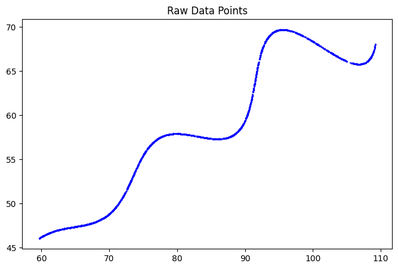
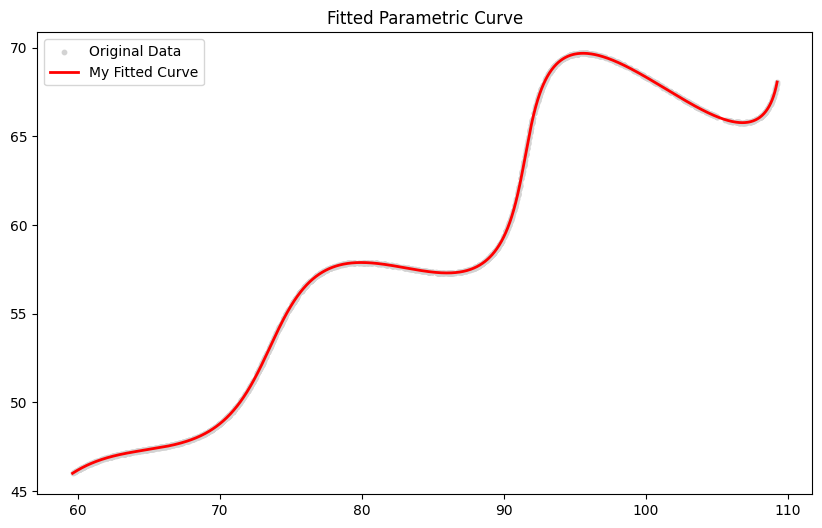

# AI R&D Curve Fitting Assignment


This repository contains my solution to the parametric curve-fitting assignment. The goal of this project is to recover three unknown parameters (`theta`, `M`, `X`) from a complex parametric equation, given an unordered cloud of `(x, y)` coordinates.

## 📁 Repository Structure

- `solution.ipynb`: The main Jupyter Notebook containing the full walkthrough, mathematical logic, and code.
- `data/xy_data.csv`: The provided dataset of coordinates.
- `requirements.txt`: Python dependencies required to run the notebook.

## 🚀 How to Run

1. **Clone the repository:**
   ```bash
   git clone <your-repo-url>
   cd flam-curve-fit
   ```

2. **Install the required dependencies:**
   ```bash
   pip install -r requirements.txt
   ```

3. **Launch the Jupyter Notebook:**
   ```bash
   jupyter notebook solution.ipynb
   ```
   *Run all the cells from top to bottom to see the step-by-step optimization process and the final plotted results.*

## 🧠 Methodology

Since the provided dataset contains `(x, y)` points without their corresponding `t` values (and the order of the points is unknown), a standard least-squares regression cannot be used directly. 

Instead, I implemented a **Nearest-Neighbor Global Optimization** approach:
1. Generate a densely sampled theoretical curve based on a set of candidate parameters.
2. Use a **KD-Tree** to rapidly calculate the shortest distance from every raw data point to the theoretical curve.
3. Minimize this total distance using **Differential Evolution** (to avoid getting stuck in local minima in the highly non-convex loss landscape), followed by a **Nelder-Mead** polish for extreme precision.

## 📈 Results

The optimization successfully extracted the variables, and the final parametric curve perfectly overlays the provided data points. Check out `solution.ipynb` for the exact parameter values and the final visualization!

### Original Data


### Final Fitted Curve

